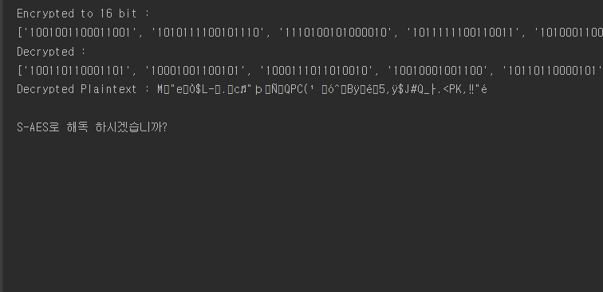
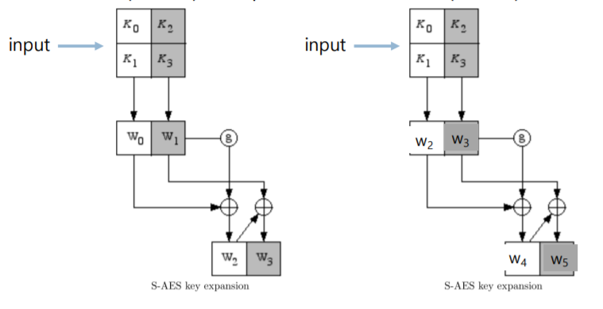
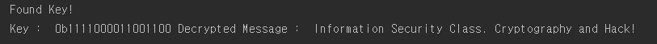

# simpleAES-python

python을 활용한 simple-AES 암호화 기법으로 암호화된 메시지를 복호화하는 코드입니다.

## simple AES란?
- 표준 암호화 알고리즘으로 Rijmen과 Daemen이 개발한 암호화 표준
- AES암호화 거의 비슷하지만 규모를 작게한 것이 Simple AES입니다.

## Simple AES 특징
- Key Size : 16 bits
- Block Size : 16 biys
- Number of Rounds : 2 rounds

## Overview

##  flow

- 키 (16 비트)의 네 개의 nible(4 비트)로 나눈후 2개씩 그룹핑하여 두 개의 8 비트 "워드"(16 비트)를 만들어냅니다.

## example
if, Key : 0000 1111 0000 1111 이라면,,

####  Key Generation
w0 = 0100 1010
w1 = 1111 0101

< w2 >
1) w0를 받아와 4bit의 N0,N1으로 나눈 후 swapping(RotNib)을 해줍니다.
2) S-BOX(SubNib)를 이용해 맞는 bit를 찾아 N0’,N1’ 로 변환합니다.
3) FirstRound에는 1000 0000 과 X0R 연산을 하여 나오는 bit로 w2를 구합니다.

< w3 >
1) 위에서 구해진 w2와 w1로 XOR 연산을 통해 새로운 w3을 구합니다.

< w4 >
1) w2를 받아와 4bit의 N2,N3으로 나눈 후 swapping(RotNib)을 합니다.
2) S-BOX(SubNib)를 이용해 맞는 bit를 찾아 N2’, N3’로 변환합니다.
3) SecoundRound에는 0111 0000과 XOR 연산을 하여 나오는 bit로 w4를 구합니다.

< w5 >
1) 위에서 구해진 w4와 w3로 XOR 연산을 통해 w5를 구합니다.

# Code Review
## oerview

## Explain
- 암호화된 암호문
~~~
encryptedList = [
'1001001100011001', '1010111100101110', '1110100101000010', 
'1011111100110011', '1010001100011110', '1101000100101111', 
'1010101010000110', '101110010010001', '11100101000001', 
'11110101110001', '1001111010001', '1100010111001001', ....
~~~

- 암호문이 해독이 되려면 크기가 16비트여야한다. 
그렇기 때문에 16비트가 아닌 암호문인 경우 0을 채워 16비트로 만들어준다.

~~~
def bitsTo16bits(encryptedList):
    for x in range(len(encryptedList)):
        if(len(encryptedList[x]) < 16):
            encryptedList[x] = encryptedList[x].zfill(16)
    return encryptedList
~~~
- 16비트로 바뀐 암호문
~~~
Encrypted to 16 bit :
['1001001100011001', '1010111100101110', '1110100101000010', 
'1011111100110011', '1010001100011110', '1101000100101111', 
'1010101010000110', '0101110010010001', '0011100101000001', 
'0011110101110001', '0001001111010001', '1100010111001001', 
'1011110010010000', '1000000100100111', '0101110010011110', .....
~~~

- 그 후 key로 암호문을 풀어야하는데 key를 알아낼 수 없으니 BruteForce 형식으로 key을 알아낸다.
~~~
 for key in range(0b01000000000000000, 0b10000000000000000):
            decryptedList = []
            decryptedPlaintext = []
            print("Key:" + getBin(key))
            for cipher in encryptedList16Bits:
                ciphertext = cipher
                keyExpansion(key)
                plaintext = decrypt(int(cipher, 2))
                decryptedList.append(getBin(plaintext))
~~~
- 16비트 이기 때문에 key의 범위는 0b01000000000000000부터 0b0111111111111111111까지 돌면서 하나 씩 대입해본다.

~~~
 if(detectEnglish.isEnglish(decryptedPlaintext)):
    print("Found Key!")
    print("Key : ", bin(key), "Decrypted Message : ", decryptedPlaintext)
    break
~~~
- 그 중 detectEnglish 파이썬 파일에 있는 isEnglish 함수를 불러 key별로 해독한 문장을 넣어줍니다.
- 그렇게 되면 isEnglish에서 dictionary.txt파일에 있는 문장이 발견되면 return 하여 의미있는 문장을 찾습니다.
- 의미 있는 문장을 찾게되면 그 문장을 찾아낸 key와 decryptedPlainText를 출력시킵니다.

