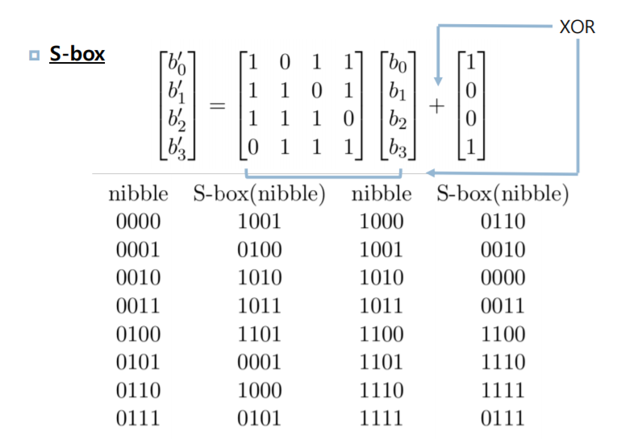

# simpleAES-python

python을 활용한 simple-AES 암호화 기법으로 암호화된 메시지를 복호화하는 코드입니다.

## simple AES란?
- 표준 암호화 알고리즘으로 Rijmen과 Daemen이 개발한 암호화 표준
- AES암호화 거의 비슷하지만 규모를 작게한 것이 Simple AES입니다.

## Simple AES 특징
- Key Size : 16 bits
- Block Size : 16 biys
- Number of Rounds : 2 rounds

## Overview

##  flow

- 키 (16 비트)의 네 개의 nible(4 비트)로 나눈후 2개씩 그룹핑하여 두 개의 8 비트 "워드"(16 비트)를 만들어냅니다.

## example
if, Key : 0000 1111 0000 1111 이라면,,

####  Key Generation
w0 = 0100 1010
w1 = 1111 0101

< w2 >
1) w0를 받아와 4bit의 N0,N1으로 나눈 후 swapping(RotNib)을 해줍니다.
2) S-BOX(SubNib)를 이용해 맞는 bit를 찾아 N0’,N1’ 로 변환합니다.
3) FirstRound에는 1000 0000 과 X0R 연산을 하여 나오는 bit로 w2를 구합니다.

< w3 >
1) 위에서 구해진 w2와 w1로 XOR 연산을 통해 새로운 w3을 구합니다.

< w4 >
1) w2를 받아와 4bit의 N2,N3으로 나눈 후 swapping(RotNib)을 합니다.
2) S-BOX(SubNib)를 이용해 맞는 bit를 찾아 N2’, N3’로 변환합니다.
3) SecoundRound에는 0111 0000과 XOR 연산을 하여 나오는 bit로 w4를 구합니다.

< w5 >
1) 위에서 구해진 w4와 w3로 XOR 연산을 통해 w5를 구합니다.

#### S-box
